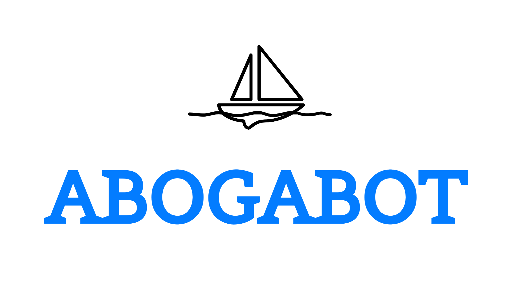
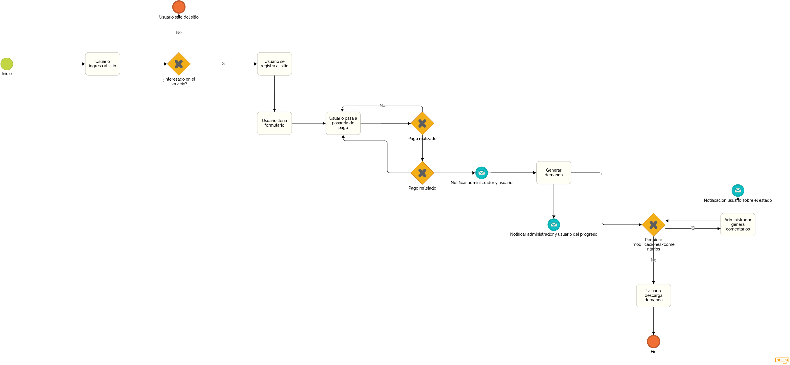
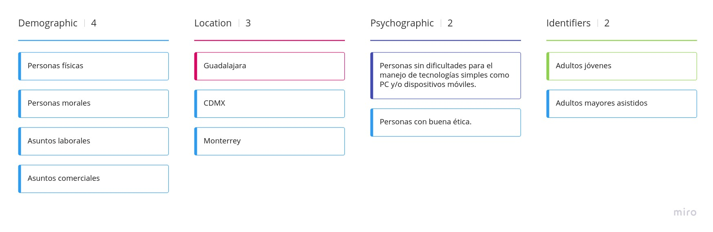

# Abogabot
___
- [Abogabot](#abogabot)
  - [Descripción caso de estudio](#descripción-caso-de-estudio)
    - [Especificación de requerimientos](#especificación-de-requerimientos)
    - [Diagrama](#diagrama)
    - [Audiencia objetivo](#audiencia-objetivo)
    - [Wireframes](#wireframes)
___
## Descripción caso de estudio

Se tiene un despacho jurídico el cual busca automatizar la elaboración de demandas mediante un sistema web.
### Especificación de requerimientos
Para ver a detalle el documento haz click [aquí](requerimientos.pdf)

### Diagrama

### Audiencia objetivo

### Wireframes
Los wireframes elaborados se encuentran [aquí](wireframes/)